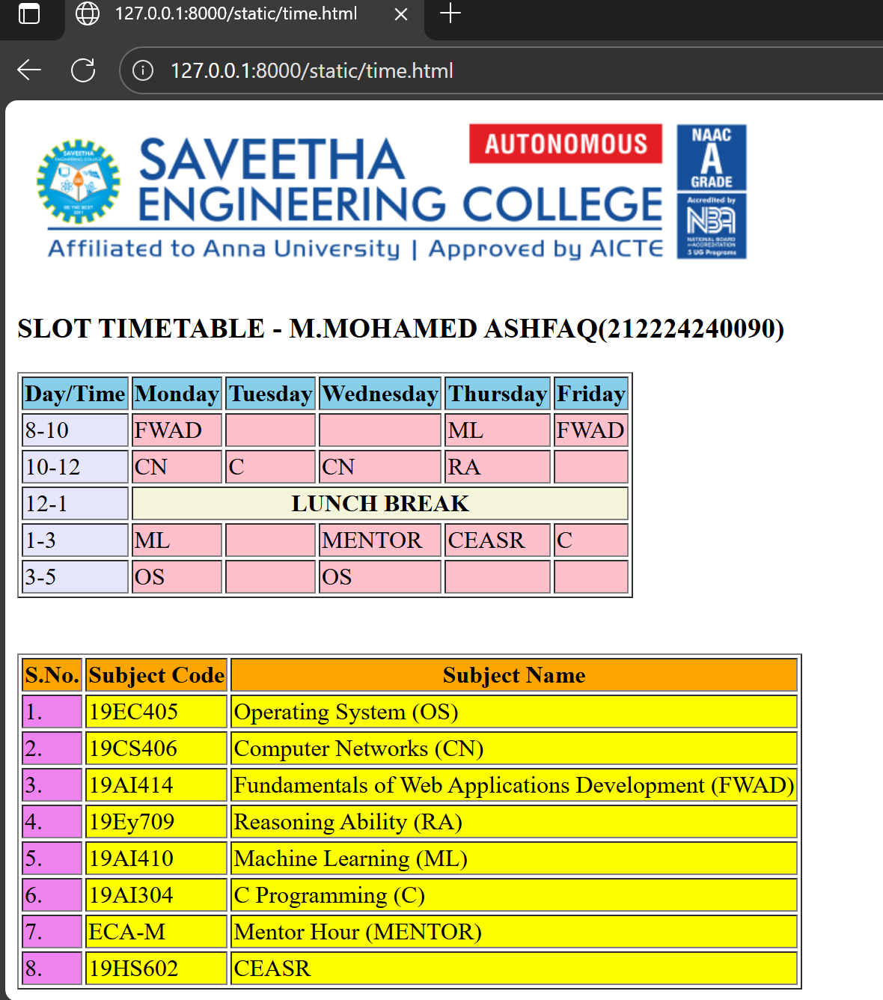

Ex03 Time Table
Date:28-09-25
AIM
To write a html webpage page to display your slot timetable.

ALGORITHM
STEP 1
Create a Django-admin Interface.

STEP 2
Create a static folder and inert HTML code.

STEP 3
Create a simple table using <table> tag in html.

STEP 4
Add header row using <th> tag.

STEP 5
Add your timetable using <td> tag.

STEP 6
Execute the program using runserver command.

PROGRAM
```
 
<h3 class="name">SLOT TIMETABLE - M.MOHAMED ASHFAQ(212224240090)</h3>
<table border="1" class="table1">
  <tr class="row1">
    <th bgcolor="skyblue">Day/Time</th>
    <th bgcolor="skyblue">Monday</th>
    <th bgcolor="skyblue">Tuesday</th>
    <th bgcolor="skyblue">Wednesday</th>
    <th bgcolor="skyblue">Thursday</th>
    <th bgcolor="skyblue">Friday</th>
  </tr>

  <tr>
    <td bgcolor="lavender">8-10</td>
    <td bgcolor="pink">FWAD</td>
    <td bgcolor="pink"></td>
    <td bgcolor="pink"></td>
    <td bgcolor="pink">ML</td>
    <td bgcolor="pink">FWAD</td>
  </tr>

  <tr>
    <td bgcolor="lavender">10-12</td>
    <td bgcolor="pink">CN</td>
    <td bgcolor="pink">C</td>
    <td bgcolor="pink">CN</td>
    <td bgcolor="pink">RA</td>
    <td bgcolor="pink"></td>
  </tr>

  <tr>
    <td bgcolor="lavender">12-1</td>
    <th colspan="6" class="x" bgcolor="beige">LUNCH BREAK</th>
  </tr>

  <tr>
    <td bgcolor="lavender">1-3</td>
    <td bgcolor="pink">ML</td>
    <td bgcolor="pink"></td>
    <td bgcolor="pink">MENTOR</td>
    <td bgcolor="pink">CEASR</td>
    <td bgcolor="pink">C</td>
  </tr>

  <tr>
    <td bgcolor="lavender">3-5</td>
    <td bgcolor="pink">OS</td>
    <td bgcolor="pink"></td>
    <td bgcolor="pink">OS</td>
    <td bgcolor="pink"></td>
    <td bgcolor="pink"></td>
  </tr>
</table>

<br /><br />

<table border="1" class="table2">
  <tr>
    <th bgcolor="orange">S.No.</th>
    <th bgcolor="orange">Subject Code</th>
    <th bgcolor="orange">Subject Name</th>
  </tr>
  <tr>
    <td bgcolor="violet">1.</td>
    <td bgcolor="yellow">19EC405</td>
    <td bgcolor="yellow">Operating System (OS)</td>
  </tr>
  <tr>
    <td bgcolor="violet">2.</td>
    <td bgcolor="yellow">19CS406</td>
    <td bgcolor="yellow">Computer Networks (CN)</td>
  </tr>
  <tr>
    <td bgcolor="violet">3.</td>
    <td bgcolor="yellow">19AI414</td>
    <td bgcolor="yellow">Fundamentals of Web Applications Development (FWAD)</td>
  </tr>
  <tr>
    <td bgcolor="violet">4.</td>
    <td bgcolor="yellow">19Ey709</td>
    <td bgcolor="yellow">Reasoning Ability (RA)</td>
  </tr>
  <tr>
    <td bgcolor="violet">5.</td>
    <td bgcolor="yellow">19AI410</td>
    <td bgcolor="yellow">Machine Learning (ML)</td>
  </tr>
  <tr>
    <td bgcolor="violet">6.</td>
    <td bgcolor="yellow">19AI304</td>
    <td bgcolor="yellow">C Programming (C)</td>
  </tr>
  <tr>
    <td bgcolor="violet">7.</td>
    <td bgcolor="yellow">ECA-M</td>
    <td bgcolor="yellow">Mentor Hour (MENTOR)</td>
  </tr>
  <tr>
    <td bgcolor="violet">8.</td>
    <td bgcolor="yellow">19HS602</td>
    <td bgcolor="yellow">CEASR</td>
  </tr>
</table>
```
OUTPUT



RESULT:
The program for creating slot timetable using basic HTML tags is executed successfully.
